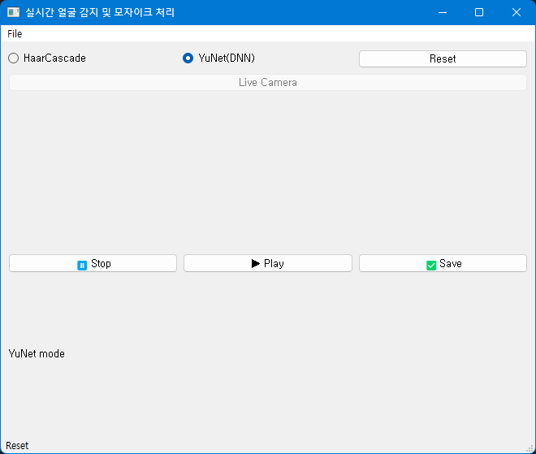

)

  

# Preview


# How To Use
``` 
python main.py 
```

# Reference
- OpenCV: Cascade Classifier, (https://docs.opencv.org/4.x/db/d28/tutorial_cascade_classifier.html)
- OpenCV: Smoothing Images, (https://docs.opencv.org/4.x/d4/d13/tutorial_py_filtering.html)
- How to display opencv video in pyqt apps, Gist, 
(https://gist.github.com/docPhil99/ca4da12c9d6f29b9cea137b617c7b8b1)
- Face_detect.py, OpenCV, Git-Hub, (https://github.com/opencv/opencv/blob/master/samples/dnn/face_detect.py)
- PyQt5 쓰레드로 동영상 재생 제어하기, https://toyourlight.tistory.com/122?category=1468376
